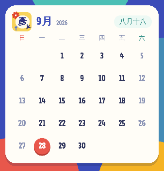
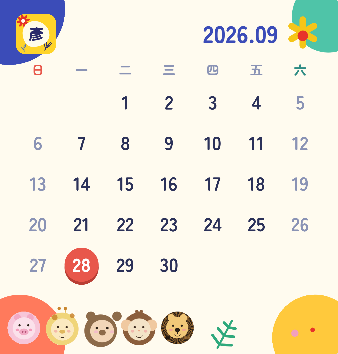
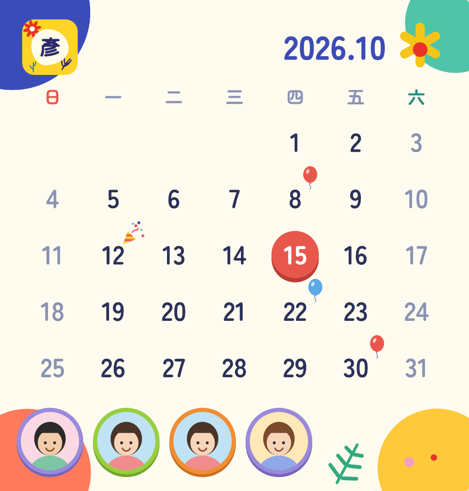
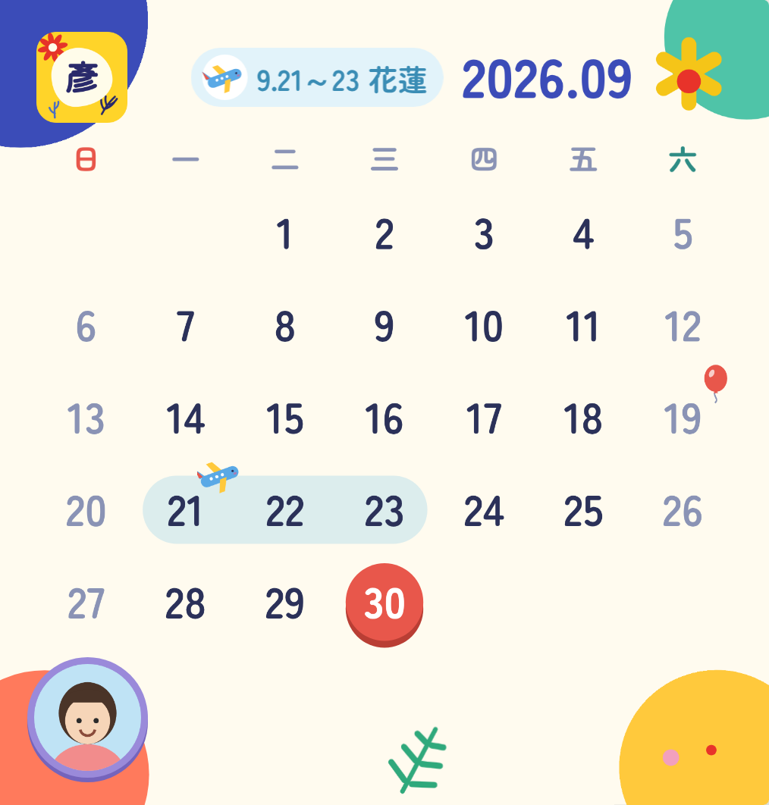

# 📅 iPhone 大尺寸月曆小工具（Scriptable）

iPhone 內建的「月曆」小工具只有小尺寸。這個 [Scriptable](https://scriptable.app/) 腳本可以做出**大尺寸**的月曆小工具，配色沿用旅遊記帳系統（藍底、彩色色塊、米白卡片）。

- 右上角顯示年月（例如 2026.09）
- 一週從星期日開始，週末用灰字
- 今天用紅色圓圈標示，左上角是 Claude Design 設計的黃底「彥」圖示（Huninn 字型、紅花、葉枝），第一次執行時照設計稿畫成圖存起來
- 字型使用 Google Fonts 的 [Zen Maru Gothic](https://fonts.google.com/specimen/Zen+Maru+Gothic)（數字、月份、星期都套用）。第一次在 Scriptable App 內執行時會連網下載字型、把用到的字存成小圖，之後小工具直接讀取；下載失敗時會跳出提示並說明原因，先用系統字型顯示
- 每天午夜自動更新；點小工具會打開內建行事曆

## 安裝

1. 在 Scriptable 按右上角 ＋ 新增腳本，把 `calendar-widget.js` 的內容整段貼上，命名為「月曆」，**在 App 內按 ▶︎ 執行一次**（下載字型）。
2. 回到主畫面長按空白處 →「編輯」→「加入小工具」→ Scriptable → 選**大**尺寸 → 加入。
3. 長按該小工具 →「編輯小工具」→ Script 選「月曆」。

## 大圓臉版（`calendar-widget-bigface.js`）

跟上面那份只差在底圖：改用[照片沖印排版](../photo-print-layout/README.md)內建樣板「大圓臉」的插畫（藍圓、綠圓黃花、紅圓、黃圓、葉子），拿掉中間兩個照片圓，四角的裝飾搬到小工具四角，月曆直接放在米白底上。

今天用橘色圓圈標示（iOS 系統橘）。左上角圖示的外框是黃色不規則色塊，中間的字預設是「彥」：第一次在 App 內執行時會詢問要放哪個字，之後可以從選單「圖示文字」修改（跟童趣風版共用同一個設定）。

底圖會在第一次於 App 內執行時從 GitHub 下載 `photo-print-layout/builtin-templates/` 裡的 `t9.png` 並處理好存起來。兩份腳本的快取資料夾分開，可以同時使用。

### 壽星照片（大圓臉版）

在 Scriptable App 內執行大圓臉版時會出現選單：

- **預覽小工具**
- **新增壽星**：輸入名字和生日（月、日），再從相簿選一張照片，會自動裁成圓形
- **照片位置**：左下（預設）或右下，照片都排在最下面一排
- **管理壽星**：修改名字或生日、換照片、刪除

當月有壽星時，照片會依生日先後排在最下面一排（不會擋到日期，人多時自動縮小），外框依序是紫、綠、橘，生日那天的日期旁依序出現紅氣球、拉炮、藍氣球（第 4 位起重複）。2/29 生日在平年會顯示在 2/28。

壽星資料和照片存在 iCloud Drive 的 `Scriptable/calendar-widget-birthdays/`（沒開 iCloud 時存在本機）。之後打開 iCloud 雲碟時，在 App 內執行一次月曆（大圓臉版或童趣風版皆可），就會自動把本機的壽星、照片、旅程搬到 iCloud（已在 iCloud 的資料不會被蓋掉，本機那份改名為 `calendar-widget-birthdays-已搬到iCloud` 留作備份），同一個 Apple 帳號的其他裝置就能共用。如果兩台裝置各自輸入過同樣的壽星或旅程，合併後會出現重複，選單會出現「移除重複資料」，每組只留一筆（有照片的優先）。

### 旅程（大圓臉版）

選單裡的 **新增旅程**：輸入地點、年份（預設今年，可改成明年以後）、出發日、回程日（例如 9/21、9/23；回程日比出發日早會算成隔年），再選交通工具（飛機、火車、汽車）。**管理旅程** 可以修改或刪除。

- 年月左邊顯示粉藍膠囊標籤，例如「9.21～23 花蓮」（跨月顯示「9.30～10.2」）；同一個月有多趟時，年月左邊顯示進行中或接下來的那一趟，其他旅程（最多 2 趟）放在最下面一排、壽星照片旁邊的空位，空位太窄就不放
- 旅程日期的數字後面加粉藍色帶，跨週會分段
- 出發日的數字旁放交通工具；同一天也有生日時，氣球會並排在左邊
- 標籤在新增旅程時用 Zen Maru Gothic 畫好存起來（需要網路），失敗時先用系統字型顯示

## 童趣風版（`calendar-widget-kids.js`）

照設計系統「童趣風」重新配色的月曆，壽星和旅程功能都保留。是另一份獨立的腳本，不會取代上面兩版；快取資料夾分開（`calendar-widget-kids`），可以同時使用。

- 米白紙底，右上角黃色色塊（手繪閃亮），左下淡粉、右下淡青色塊
- 數字和年月用 [Gluten](https://fonts.google.com/specimen/Gluten)，中文用跟大圓臉版一樣的 [Zen Maru Gothic](https://fonts.google.com/specimen/Zen+Maru+Gothic)，文字是墨藍色；星期日深紅、星期六藍色
- 左上角是深色版圖示（深藍不規則色塊、紅花、黃色不規則圓、黃枝和藍枝），中間的字預設是「彥」。第一次在 App 內執行時會詢問要放哪個字，之後可以從選單「圖示文字」修改，適合分享給朋友使用
- 今天用黃色不規則色塊標示
- 壽星照片外框依生日先後輪流用粉紅、湖水青、太陽黃、深藍；生日那天的日期旁是圖示貼紙，依序是星星、愛心、禮物、氣球（第 5 位起重複）
- 旅程依日期先後輪流用淡藍、淡青、淡粉，年月左邊的標籤、下方的標籤和月曆色帶同一趟同色；出發日旁的交通工具跟大圓臉版一樣
- 下方沒有照片也沒有旅程標籤的空位，放三隻色塊小怪獸

**跟大圓臉版共用資料**：壽星、照片、旅程都存在同一個 `Scriptable/calendar-widget-birthdays/`，在任何一版新增或修改，兩版都會顯示。在大圓臉版新增的旅程，童趣風版的標籤會在下次於 App 內執行童趣風版時補畫；在童趣風版新增或修改的旅程，也會一起更新大圓臉版的標籤。

安裝方式同上：新增腳本貼上 `calendar-widget-kids.js`，命名為例如「童趣風月曆」，在 App 內執行一次（下載字型、畫圖示），再把大尺寸小工具的 Script 選它。
